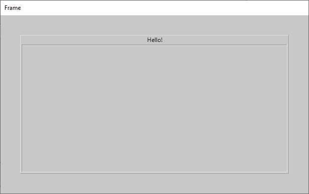
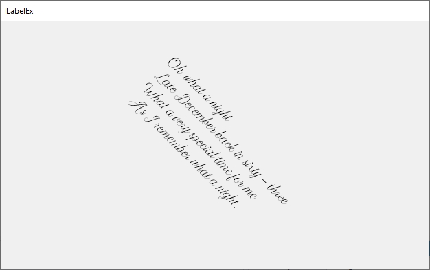
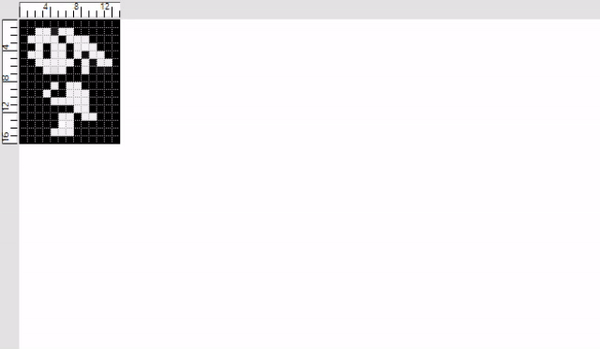
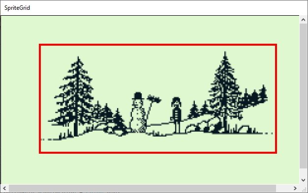

# More

*by Tomaz Stih*

A growing collection of (MIT licensed) Windows Forms Controls for .NET Core.

# Controls (Alphabetically)

 * [Frame](#frame) Structure and draw on panel without affecting the content.
 * [Hierarchy](#hierarchy) Draw and manipulate trees.
 * [LabelEx] (#labelex) Label that can rotate and supports transparency.
 * [Line](#line) Use custom line as a separator or a decorator.
 * [SpriteGrid](#spritegrid) Use sprite grid control to build a sprite editor.

# Frame

To understand the `Frame` control, you first need to understand its base control - the
`PanelEx`. This control enables you to create non-client border around the `PanelEx`, 
and have WinForms respect it, for example, when docking children inside the `PanelEx`.

## Background: The PanelEx Control

To create a new container control with a non-client area, derive it from `PanelEx`, 
and set the `Margin`. Area outside will be non-client area and area inside the margins 
the client area. 

 > For example, if you set all margins to 10 pixels, then a 10 pixels wide border
 > around the control will be non-client area, and the rest client area.

You can use the client area just as you would use the standard`Panel` control i.e. 
you put controls inside, dock them, etc. If you want to paint on non-client, override 
the `Decorate()` function.

The functionality of `PanelEx` provides glue, required to implement various container 
controls. Here are just a few possibilities:
 * Frame controls,
 * Collapsible controls,
 * Prompt controls...

### How to derive from PanelEx

Here is the skeleton of panel, derived from the `PanelEx`. Margin is set
in the constructor, and drawing on non-client area should happen inside the
`Decorate()`. This function prepares everything for you: it creates the graphics 
and calculates all rectangles that form the non-client border. 

~~~cs
public class MyPanel : PanelEx
{
    public class MyPanel() {
        // Create a 5 pixel unified non client 
        // area around the panel.
        Margin=new Padding(5,5,5,5);
    }

    protected override void Decorate(
        Graphics g, 
        Rectangle lt, // Left top rectangle of NC area.
        Rectangle rt, // Right top rectangle of NC area.
        Rectangle lb, // Left bottom rectangle of NC area.
        Rectangle rb, // Right bottom rectangle of NC area.
        Rectangle l, // Left rectangle of NC area.
        Rectangle t, // Top rectangle of NC area.  
        Rectangle r, // Right rectangle of NC area.
        Rectangle b) // Left top rectangle of NC area.
    {
        // Here you draw in nonclient area.
    }
}
~~~

## Frame Control: Usage

Back to our `Frame` control. 

It has four areas. 
 * First (top) area is the title. You can set it via
   the `Title` propety. It uses the `Font` property. You can set 
   values of the `TitleBackColor` and `TitleFrontColor`. The title
   is adjusted by `TitleAlignment`. If aligned left or right, the 
   `TitleOffset` is the identation. Last but not least, you
   can increase or reduce (even hide!) title height by changing the 
   value of `TitleHeight`.
 * Second area is the outer border. This border has `OuterBorderThickness`,
   `OuterBorderDarkColor` and `OuterBorderLightColor`. By convention the
   dark color is used for top and left edge, and the light color for the bottom
   and right edge. For the inset effect, simply swap these colors.
 * Third area is the inner border. This border has `InnerBorderThickness`,
   `InnerBorderDarkColor` and `InnerBorderLightColor`. By default the
   thickness is zero so no inner border is shown.
 * Fourth area is the `BorderThickness` (in pixels). This is simply the space
   between outer border and inner border. It can be zero but then it is very hard
   to differentiate between inner and outer border.
 

## Examples

~~~cs
// First the title.
_frame.Title = "Hello!";
_frame.TitleAlignment = StringAlignment.Center;
_frame.TitleHeight = 16;
_frame.TitleBackColor = BackColor;
_frame.TitleForeColor = ForeColor;

// Outer border.
_frame.OuterBorderDarkColor = Color.FromKnownColor(KnownColor.ControlDark);
_frame.OuterBorderLightColor = Color.FromKnownColor(KnownColor.ControlLight);
_frame.OuterBorderThickness = 1;

// Inner border (replace dark and light).
_frame.InnerBorderDarkColor = Color.FromKnownColor(KnownColor.ControlLight);
_frame.InnerBorderLightColor = Color.FromKnownColor(KnownColor.ControlDark);
_frame.InnerBorderThickness = 1;

// Pixels between inner and outer color.
_frame.BorderThickness = 2;
~~~

The code above creates the frame below.

# Hierarchy

You can use the `Hierarchy` control to visualise trees. The control only does the 
layouting; it expects your code to draw content inside events.

## Usage

You set the tree direction by manipulating the `Direction` property.
The control can draw *left to right*, *right to left*, *top to bottom*, and *bottom
to top* trees. 

Basic general node properties (shared between all nodes!) are: `NodeWidth` 
and `NodeHeight`. The minimal space in pixels between two nodes is determined 
by the `NodeHorzSpacing` and `NodeVertSpacing` properties.

You feed the data into the control by implemening a simple `IHierarchyFeed`
interface, and then passing it to the `Hierarchy` via the `SetFeed()` method.

Here is the interface.

~~~cs
public interface IHierarchyFeed
{
    IEnumerable<string> Query(string key=null);
}
~~~

It only has one function which returns a collection of node keys (node identifiers).
 
 > Since your code is responsible for drawing nodes and edges, the control really 
 > does not need to know more about the node. When it needs to draw it it passes the 
 > node key and rectangle in an event and expects your code to do the rest. 

The `Query()` function accepts a *parent key* parameter. If this parameter is null, 
the function returns all root node keys (usually just one?), otherwise it returns child
nodes of provided *parent node*.

You can capture all standard control mouse events, and inside the mouse events translate 
mouse coordinates to nodes key by calling `NodeAt()` function.

## Examples

### File system feed

Here's a simple feed implementation for the file system. 

~~~cs
public class FileSystemHierarchyFeed : IHierarchyFeed
{
    private string _rootDir;

    public FileSystemHierarchyFeed(string rootDir) { _rootDir = rootDir; }

    public IEnumerable<string> Query(string key = null)
    {
        if (key == null) return new string[] { _rootDir };
        else return Directory.EnumerateDirectories(key + @"\");
    }
}
~~~

In the example above the full path is used as a node key. If you wanted to draw
organigram, you'd probably use database identifier of a person as the key.

  > Dislaimer: Letting the above file feed scan your `c:` drive is a very bad idea.
    Just sayin'. 

### Drawing functions

There are two events that you can subscribe to: the `DrawEdge` event to an edge i.e. a line 
connecting two nodes. And the `DrawNode` event to draw a node. Both events will pass you
node key, node rectangle, and an instance of the `Graphics` to use for drawing.

 > ...but drawing nodes and edges is your job.

This sample demonstrates drawing inside both events.

~~~cs
private void _hierarchy_DrawEdge(object sender, DrawEdgeEventArgs e)
{
    // Calculate node centers.
    Point
        start = new Point(
            e.ParentRectangle.Left + e.ParentRectangle.Width / 2,
            e.ParentRectangle.Top + e.ParentRectangle.Height / 2),
        end = new Point(
            e.ChildRectangle.Left + e.ChildRectangle.Width / 2,
            e.ChildRectangle.Top + e.ChildRectangle.Height / 2);
    // And draw the line.
    using (Pen p = new Pen(ForeColor)) 
        e.Graphics.DrawLine(p,start,end);
}

private void _hierarchy_DrawNode(object sender, DrawNodeEventArgs e)
{
    // Extract directory name from the path.
    string dir= Path.GetFileName(Path.GetDirectoryName(e.Key+@"\"));

    // Draw the node.
    Graphics g = e.Graphics;
    using (Pen forePen = new Pen(ForeColor))
    using (Brush backBrush = new SolidBrush(BackColor),
        foreBrush = new SolidBrush(ForeColor))
    using(StringFormat sf=new StringFormat() { 
        LineAlignment=StringAlignment.Center, 
        Alignment=StringAlignment.Center})
    {
        g.FillRectangle(backBrush, e.Rectangle); // Border.
        g.DrawRectangle(forePen, e.Rectangle); // Rectangle.
        g.DrawString(dir, Font, foreBrush, e.Rectangle, sf); // Text.
    }
}
~~~

### Mouse input

You can subscribe to standard mouse events (clicks, moves, etc.) and use the `NodeAt()` 
function to find out which node was clicked. For example, if you'd like to 
highlight node on click, subscribe to the `MouseUp` event, find out which node was
clicked, store its key, and call `Refresh()` to repaint the control.

~~~cs
private string _highlightedNodeKey;
private void _hierarchy_MouseUp(object sender, MouseEventArgs e)
{
    _highlightedNodeKey = _hierarchy.NodeAt(e.Location);
    _hierarchy.Refresh();
}
~~~

Then, in the `DrawNode` event, check the node key against the `_highlightedNodeKey` and
paint it accordingly.

### Styling edges

Because the `DrawEdge` event gives you both ends of the edge - the parent node and 
the child node (with their coordinates), you can chose how to draw your edge. 
It can be a line, a curve, etc. You may also start your edge at end of the parent node 
(instead of node center) and draw it to start of the other node. Following code does
just that, see image for the result.

~~~cs
private void _hierarchy_DrawEdge(object sender, DrawEdgeEventArgs e)
{
    // Change start and end location of an edge.
    Point
        start = new Point(
            e.ParentRectangle.Right,
            e.ParentRectangle.Top + e.ParentRectangle.Height / 2),
        end = new Point(
            e.ChildRectangle.Left,
            e.ChildRectangle.Top + e.ChildRectangle.Height / 2);
    using (Pen p = new Pen(ForeColor))
        e.Graphics.DrawLine(p, start, end);
}
~~~

# LabelEx

Label that can rotate and supports transparency.

## Usage

Transparency is a pain in Windows Forms. This feature works well at runtime, but behaves 
naughty in the designer. The reason is that it avoids double buffering to implement 
transparency. To make the label background transparent, set the `Opacity` property 
from 0% to 100% (for fully transparent label). 

Rotate the label by setting the `Angle`. The unit is in degrees, and the rotation is clockwise.

Finally, you can align the rotated label to the bounding rectangle by assigning values to 
properies `HorzAlignment` and `VertAlignment`.

## Examples

~~~cs
_label.Text = "Oh, what a night\nLate December back in sixty - three\nWhat a very special time for me\nAs I remember what a night.";
_label.Angle = 45;
_label.HorzAlignment = StringAlignment.Center;
_label.VertAlignment = StringAlignment.Center;
~~~

And the result...

# Line

Vertical or horizontal line control, used as a separator or a decorator. 

## Usage

Set the `Orientation` property to `Horizontal` or `Vertical`. Use line 
`Thickness` to set the pen thickness. Set line `Text`,`Font`, and `ForeColor` 
properties to control appearance of title. If empty, no title is shown.
`TextAlignment` tells where the title is shown (at beginning, end or in the
middle of line). If at beginning or end then `TextOffset` (in pixels) is
used to move title away from begin/end point. `BackColor` controls line control 
background, and `LineColor` is used for line color. `DashValues` is an array
of floats that tells size of pixels and spaces. Default value of `{1,0}` means
solid line (i.e. one pixel, followed by zero spaces). A value of `{1,1}` is
interpreted as a pixel followed by a space. The pattern can be of arbitrary
length i.e. a value of `{3,1,1,1}` would be interpreted three pixels, 
followed by one space, followed by one pixel, followed by one space.

## Examples

~~~cs
_line.Orientation = Orientation.Horizontal;
_line.Text = string.Empty; // Remove text.
_line.LineColor = Color.Khaki;
_line.BackColor = Color.DarkSeaGreen;
_line.Thickness = 6;
_line.DashValues = new float[] { 3,1,1,1 };
~~~

# SpriteGrid

Raster image viewer (with mouse events and zoom), a basis for a sprite editor.

## Usage

Place the `SpriteGrid` control on your window. Set its `SourceImage` property to
the `Bitmap` you'd like to view or edit and you're done. 

You can show or hide rulers using the `ShowHorzRuler` and `ShowVertRuler` properties.
You can customize rulers by manipulating properties: `RulerHeight`, `RulerWidth`, 
`RulesBackgroundColor`, `MinorTickSize`, `MajorTickSize`, and 'MinorTicksPerMajorTick'.

You can customize grid appearance by manipulating properties `GridEdgeLineColor`,`GridEdgeLineDashPattern`,
`GridTickLineColor`, `GridTickLineDashPattern`.

`BackColor` is used to draw empty grid, and `ForeColor` is used for all text (currently just
the ruler content).

## Examples

### Passing image

You pass image to SpriteGrid by assigning the image to the `SourceImage` property.

~~~cs
_spriteGrid.SourceImage = Image.FromFile("pacman.png");
~~~

### Responding to events

SpriteGrid exposes basic mouse events and translates physical coordinates to logical
coordinates inside the sprite (i.e. row and column). To manipulate the sprite, 
simply manipulate the underlying image and call the `Refresh()` function on
SpriteGrid.

~~~cs
public partial class MainWnd : Form
{
    // ... code omitted ...
    private Bitmap _sprite;

    private void MainWnd_Load(object sender, System.EventArgs e)
    {
        // Create new 16x16 sprite.
        _spriteGrid.SourceImage = _sprite = new Bitmap(16, 16);
    }

    private void _spriteGrid_CellMouseDown(object sender, CellMouseButtonArgs e)
    {
        // Set image pixel.
        _sprite.SetPixel(e.Column, e.Row, Color.Black);
        _spriteGrid.Refresh();
    }
    // ... code omitted ...
}
~~~

### Implementing zoom

SpriteGrid uses mouse wheel for two purposes. If wheel is used without any control
key then sprite is scrolled up and down. If, while using the mouse wheel, you hold
down Ctlr key then the `ZoomIn` and `ZoomOut` events are triggered. You can use
this to implement zoom.

The simplest implementation (which would not consider the current mouse position),
would be increasing and decreasing values or properties `CellWidth` and `CellHeight`.

~~~cs
private void _spriteGrid_ZoomIn(object sender, ZoomInArgs e)
{
    if (_spriteGrid.CellWidth < 32) _spriteGrid.CellWidth++;
    if (_spriteGrid.CellHeight < 32) _spriteGrid.CellHeight++;
}

private void _spriteGrid_ZoomOut(object sender, ZoomOutArgs e)
{
    if (_spriteGrid.CellWidth > 1) _spriteGrid.CellWidth--;
    if (_spriteGrid.CellHeight > 1) _spriteGrid.CellHeight--;
}
~~~

And the result.

### Visible margins

Sometimes it makes sense to set a visible sprite margin (for example, to show where
image will be cropped). Six properties controling sprite margin: `LeftMargin`,
`RightMargin`, `TopMargin`, `BottomMargin`, `MarginLineThickness`, and
`MarginColor`.

 > Sprite margin is not the same as control margin. Sprite margin is an area of sprite
 > that is visibly marked.

~~~cs
_spriteGrid.SourceImage = Image.FromFile("art.png");
_spriteGrid.LeftMargin = 40;
_spriteGrid.RightMargin = 40;
_spriteGrid.TopMargin = 30;
_spriteGrid.BottomMargin = 40;
_spriteGrid.MarginLineThickness = 4;
_spriteGrid.MarginColor = Color.Red;
~~~

### Selections

By responding to mouse events `CellMouseDown`, `CellMouseUp, `CellMouseMove` you 
can detect select operation.

 > To differentiate between a select and a pixel click you need to compare mouse
 > coordinates at `CellMouseDown` event with that of `CellMouseUp`. If 
 > coordinates are the same and there were no `CellMouseMove` events out o the
 > cell then it is a click. Otherwise it is a select.

To make SpriteEdit draw a selection you set the property GridSelection. 
GridSelection is a polygon and can be of any shape.

~~~cs
_spriteGrid.SourceImage = Image.FromFile("jetpac.png");
_spriteGrid.SetGridSelection(new GridSelection()
{
    LineColor = Color.White,
    LineWidth = 3,
    Poly = new Point[] { 
        new Point(200,200), 
        new Point(400, 200), 
        new Point(400,400), 
        new Point(200,400)}
});
~~~

