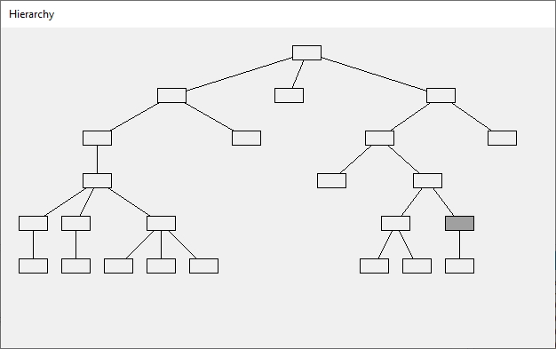
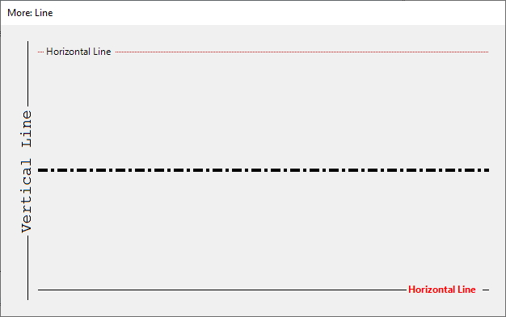
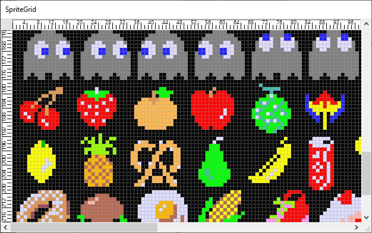
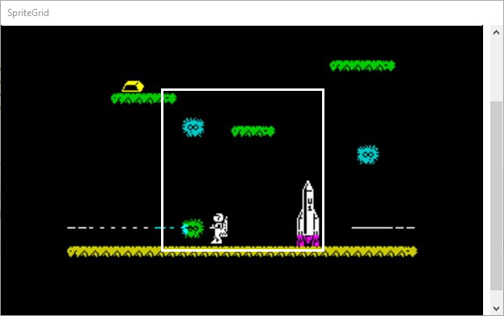

# More

*by Tomaz Stih*

A growing collection of (MIT licensed) Windows Forms Controls for .NET Core.

# Controls (Alphabetically)

 * [Frame](#frame) Structure and draw on panel without affecting the content.
 * [Hierarchy](#hierarchy) Drawing and manipulating trees.
 * [Line](#line) Line control used a separator or a decorator.
 * [SpriteGrid](#spritegrid) Sprite grid control, base for a sprite editor.

# Frame

The `Frame` control is an example a `PanelEx` derivate. It is a panel with 
a customisable header, inner and outer border.

## Background

`Frame` is derived from `PanelEx` and demostrates how to use it. The `PanelEx`
is a panel that allows creating and dawing on "non-client area" of arbitrary size 
around it. 

You create a new panel control by deriving from `PanelEx`. You set the `Margin` 
property to desired client margin. This creates a non client area around your client
area. Finally, you overriding the `Decorate()` function to draw in the new non-client area.

All layouting (docking, etc.) is done by the control and is allowed only inside the 
client area.

~~~cs
public class MyPanel : PanelEx
{
    public class MyPanel() {
        // Create a 5 pixel unified non client 
        // area around the panel.
        Margin=new Padding(5,5,5,5);
    }

    protected override void Decorate(
        Graphics g, 
        Rectangle lt, // Left top rectangle of NC area.
        Rectangle rt, // Right top rectangle of NC area.
        Rectangle lb, // Left bottom rectangle of NC area.
        Rectangle rb, // Right bottom rectangle of NC area.
        Rectangle l, // Left rectangle of NC area.
        Rectangle t, // Top rectangle of NC area.  
        Rectangle r, // Right rectangle of NC area.
        Rectangle b) // Left top rectangle of NC area.
    {
        // Here you draw in nonclient area.
    }
}
~~~

## Usage

## Examples

# Hierarchy

Draw custom trees. The control does layouting and asks you to draw
nodes and edges yourself.

# Line

Vertical or horizontal line control, used as a separator or a decorator. 

## Usage

Set the `Orientation` property to `Horizontal` or `Vertical`. Use line 
`Thickness` to set the pen thickness. Set line `Text`,`Font`, and `ForeColor` 
properties to control appearance of title. If empty, no title is shown.
`TextAlignment` tells where the title is shown (at beginning, end or in the
middle of line). If at beginning or end then `TextOffset` (in pixels) is
used to move title away from begin/end point. `BackColor` controls line control 
background, and `LineColor` is used for line color. `DashValues` is an array
of floats that tells size of pixels and spaces. Default value of `{1,0}` means
solid line (i.e. one pixel, followed by zero spaces). A value of `{1,1}` is
interpreted as a pixel followed by a space. The pattern can be of arbitrary
length i.e. a value of `{3,1,1,1}` would be interpreted three pixels, 
followed by one space, followed by one pixel, followed by one space.

## Examples

~~~cs
_line.Orientation = Orientation.Horizontal;
_line.Text = string.Empty; // Remove text.
_line.LineColor = Color.Khaki;
_line.BackColor = Color.DarkSeaGreen;
_line.Thickness = 6;
_line.DashValues = new float[] { 3,1,1,1 };
~~~

# SpriteGrid

Raster image viewer (with mouse events and zoom), a basis for a sprite editor.

## Usage

Place the `SpriteGrid` control on your window. Set its `SourceImage` property to
the `Bitmap` you'd like to view or edit and you're done. 

You can show or hide rulers using the `ShowHorzRuler` and `ShowVertRuler` properties.
You can customize rulers by manipulating properties: `RulerHeight`, `RulerWidth`, 
`RulesBackgroundColor`, `MinorTickSize`, `MajorTickSize`, and 'MinorTicksPerMajorTick'.

You can customize grid appearance by manipulating properties `GridEdgeLineColor`,`GridEdgeLineDashPattern`,
`GridTickLineColor`, `GridTickLineDashPattern`.

`BackColor` is used to draw empty grid, and `ForeColor` is used for all text (currently just
the ruler content).

## Examples

### Passing image

You pass image to SpriteGrid by assigning the image to the `SourceImage` property.

~~~cs
_spriteGrid.SourceImage = Image.FromFile("pacman.png");
~~~

### Responding to events

SpriteGrid exposes basic mouse events and translates physical coordinates to logical
coordinates inside the sprite (i.e. row and column). To manipulate the sprite, 
simply manipulate the underlying image and call the `Refresh()` function on
SpriteGrid.

~~~cs
public partial class MainWnd : Form
{
    // ... code omitted ...
    private Bitmap _sprite;

    private void MainWnd_Load(object sender, System.EventArgs e)
    {
        // Create new 16x16 sprite.
        _spriteGrid.SourceImage = _sprite = new Bitmap(16, 16);
    }

    private void _spriteGrid_CellMouseDown(object sender, CellMouseButtonArgs e)
    {
        // Set image pixel.
        _sprite.SetPixel(e.Column, e.Row, Color.Black);
        _spriteGrid.Refresh();
    }
    // ... code omitted ...
}
~~~

### Implementing zoom

SpriteGrid uses mouse wheel for two purposes. If wheel is used without any control
key then sprite is scrolled up and down. If, while using the mouse wheel, you hold
down Ctlr key then the `ZoomIn` and `ZoomOut` events are triggered. You can use
this to implement zoom.

The simplest implementation (which would not consider the current mouse position),
would be increasing and decreasing values or properties `CellWidth` and `CellHeight`.

~~~cs
private void _spriteGrid_ZoomIn(object sender, ZoomInArgs e)
{
    if (_spriteGrid.CellWidth < 32) _spriteGrid.CellWidth++;
    if (_spriteGrid.CellHeight < 32) _spriteGrid.CellHeight++;
}

private void _spriteGrid_ZoomOut(object sender, ZoomOutArgs e)
{
    if (_spriteGrid.CellWidth > 1) _spriteGrid.CellWidth--;
    if (_spriteGrid.CellHeight > 1) _spriteGrid.CellHeight--;
}
~~~

And the result.

### Visible margins

Sometimes it makes sense to set a visible sprite margin (for example, to show where
image will be cropped). Six properties controling sprite margin: `LeftMargin`,
`RightMargin`, `TopMargin`, `BottomMargin`, `MarginLineThickness`, and
`MarginColor`.

 > Sprite margin is not the same as control margin. Sprite margin is an area of sprite
 > that is visibly marked.

~~~cs
_spriteGrid.SourceImage = Image.FromFile("art.png");
_spriteGrid.LeftMargin = 40;
_spriteGrid.RightMargin = 40;
_spriteGrid.TopMargin = 30;
_spriteGrid.BottomMargin = 40;
_spriteGrid.MarginLineThickness = 4;
_spriteGrid.MarginColor = Color.Red;
~~~

### Selections

By responding to mouse events `CellMouseDown`, `CellMouseUp, `CellMouseMove` you 
can detect select operation.

 > To differentiate between a select and a pixel click you need to compare mouse
 > coordinates at `CellMouseDown` event with that of `CellMouseUp`. If 
 > coordinates are the same and there were no `CellMouseMove` events out o the
 > cell then it is a click. Otherwise it is a select.

To make SpriteEdit draw a selection you set the property GridSelection. 
GridSelection is a polygon and can be of any shape.

~~~cs
_spriteGrid.SourceImage = Image.FromFile("jetpac.png");
_spriteGrid.SetGridSelection(new GridSelection()
{
    LineColor = Color.White,
    LineWidth = 3,
    Poly = new Point[] { 
        new Point(200,200), 
        new Point(400, 200), 
        new Point(400,400), 
        new Point(200,400)}
});
~~~

